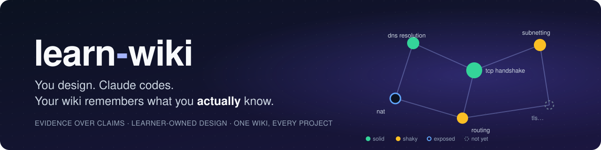

# learn-wiki

A Claude Code plugin for learning while you build. You design, Claude writes the
code — and a personal wiki remembers what you actually know, across every project.

## What it does

- **Learning-first sessions.** Claude asks for your approach before proposing
  its own, explains what you don't know yet, and implements only what you approve.
- **A wiki about you.** Your level in each concept is built from evidence —
  what you explained, designed, or implemented in real sessions — not from
  self-assessment. Claude reads it to pitch explanations at your real level.
- **Per-project memory.** Each repo keeps its own settings, pending decisions,
  and a map of the system as *you* understand it.

```text
  session in a project ──evidence──► wiki-process ──► your wiki
         ▲                                              │
         └────────── pitches teaching at your level ◄───┘
```

## Install

In Claude Code, add the marketplace, then install the plugin:

```text
/plugin marketplace add bytorbix/learn-wiki
/plugin install learn-wiki@learn-wiki
```

Restart Claude Code, then run `/learn-wiki:wiki-onboarding` once.

Or load it from a clone for one session:

```bash
git clone https://github.com/bytorbix/learn-wiki.git
claude --plugin-dir /path/to/learn-wiki
```

Requires Python 3 for the session hook.

## Use

| Command | When |
| --- | --- |
| `/learn-wiki:wiki-onboarding` | Once, ever: creates your wiki (where it lives, your experience, interests) |
| `/learn-wiki:learn` | In any project: turns on learning mode; short project onboarding the first time |
| `/learn-wiki:wiki-process <evidence-file>` | Merges a session's evidence into the wiki (`/learn` also does this for past sessions) |
| `/learn-wiki:lint` | Now and then: fixes format drift, and asks before merging duplicate concepts or removing bad aliases |

While learning, just talk normally. You can say "pause learning", "be stricter
here", "go deeper on networking", or "just implement it" at any time.

## Where things live

| Place | Holds |
| --- | --- |
| Your wiki (default `~/.learn-wiki`) | Your profile, interests, and every concept with its evidence and levels |
| `<repo>/.learning/` | This project's settings, pending checkpoints, project map, and session evidence |

Both are plain Markdown. The specs are in [`reference/`](reference/).

## Status

Early (v0.1). Not built yet: syncing the wiki across devices.

## Credits

Inspired by [VibeWise](https://github.com/nykooi1/vibe-wise) by Noah Kim.

## License

[MIT](LICENSE)
